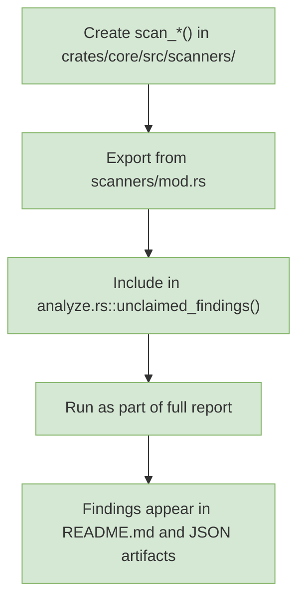
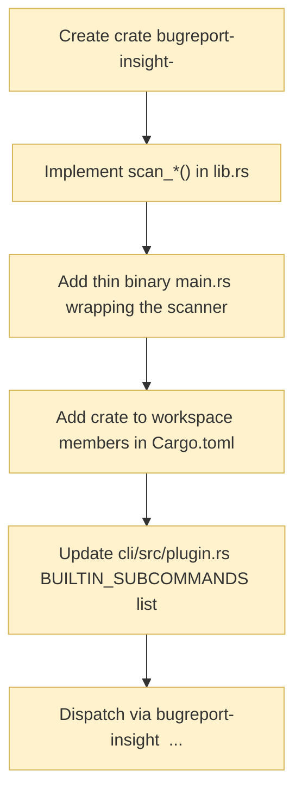

# Activity Diagrams

## Adding a new finding scanner (in‑core)

```mermaid
flowchart TD
    A["Create scan_*() in crates/core/src/scanners/"] --> B["Export from scanners/mod.rs"]
    B --> C["Include in analyze.rs::unclaimed_findings()"]
    C --> D["Run as part of full report"]
    D --> E["Findings appear in README.md and JSON artifacts"]
    style A fill:#d5e8d4,stroke:#82b366
    style B fill:#d5e8d4,stroke:#82b366
    style C fill:#d5e8d4,stroke:#82b366
    style D fill:#d5e8d4,stroke:#82b366
    style E fill:#d5e8d4,stroke:#82b366
```

## Adding a new subcommand (plugin style)

```mermaid
flowchart TD
    A["Create crate bugreport-insight-<verb>"] --> B["Implement scan_*() in lib.rs"]
    B --> C["Add thin binary main.rs wrapping the scanner"]
    C --> D["Add crate to workspace members in Cargo.toml"]
    D --> E["Update cli/src/plugin.rs BUILTIN_SUBCOMMANDS list"]
    E --> F["Dispatch via bugreport-insight <verb> ..."]
    style A fill:#fff2cc,stroke:#d6b656
    style B fill:#fff2cc,stroke:#d6b656
    style C fill:#fff2cc,stroke:#d6b656
    style D fill:#fff2cc,stroke:#d6b656
    style E fill:#fff2cc,stroke:#d6b656
    style F fill:#fff2cc,stroke:#d6b656
```
